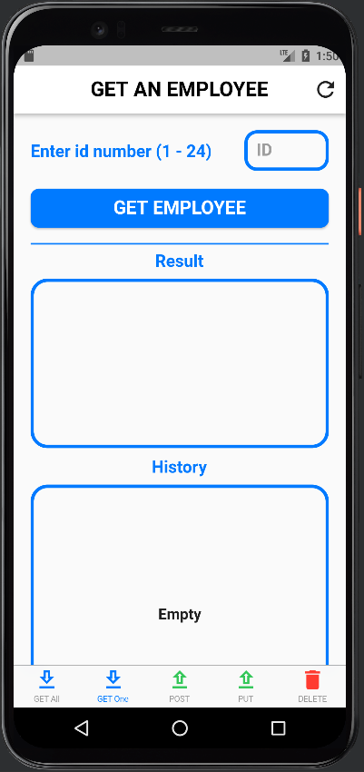
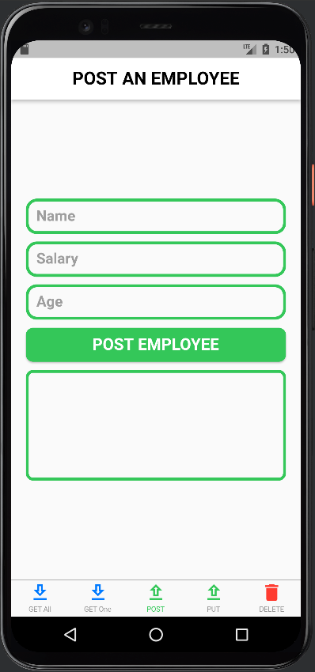
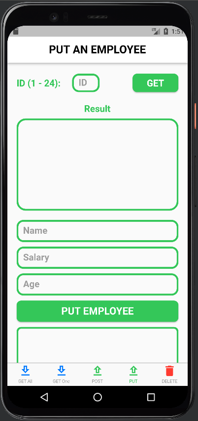
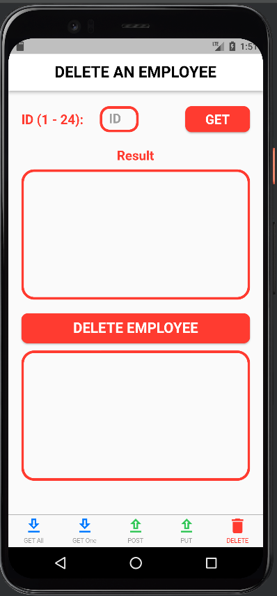

# Dummy API

### Pages:
| GET ALL EMPLOYEES | GET AN EMPLOYEE |
|----------------|:----------------:|
|  |  |

| POST AN EMPLOYEE | PUT AN EMPLOYEE | DELETE AN EMPLOYEE|
|----------------|:----------------:|:----------------:|
|  |  |  |

